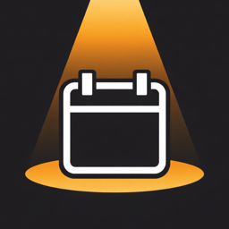

<p align="center">
  
</p>

# LightsUp

A native macOS menu bar app that makes missing meetings impossible.

## What it does

LightsUp sits quietly in your menu bar and syncs with your calendar. The moment a meeting starts,
it takes over your entire screen with an unavoidable full-screen notification. No more missing
meetings because you were deep in focus and dismissed a tiny notification.

**Core features:**
- Menu bar item with live countdown to next meeting (compact/medium/large formats); shows `● Now` while a meeting is in progress
- Calendar sync via EventKit (Apple Calendar / Google Calendar) — data never more than 5 s stale
- Full-screen takeover when a meeting starts — covers all connected displays
- Join or copy the meeting link directly from the takeover screen or the dropdown
- Ongoing event highlighted with a sweeping orange shimmer in the dropdown
- Hover tooltips on truncated event titles and action buttons
- Settings window: calendar selection, menu bar format, launch at login

## The problem it solves

Remote and hybrid professionals miss meetings constantly — not because they don't care, but because
small notification banners are too easy to miss when you're in deep focus. LightsUp makes that
impossible.

## Tech stack

- **Language:** Swift
- **UI:** SwiftUI + AppKit (NSWindow for full-screen takeover)
- **Calendar:** EventKit
- **Platform:** macOS 26 (Tahoe) and above
- **Distribution:** Direct download (notarized, outside App Store)

## Project structure

```
LightsUp/
├── LightsUp/                       # Main app source
│   ├── LightsUpApp.swift           # App entry point, MenuBarExtra, AppDelegate
│   ├── CalendarManager.swift       # @Observable EventKit wrapper, polling, store change observer
│   ├── MenuBarFormat.swift         # Countdown/label format enum + pure format functions
│   ├── MenuBarLabelView.swift      # Live menu bar label, 30 s ticker
│   ├── ContentView.swift           # Dropdown: event list, EventRowView, button/tooltip styles
│   ├── SettingsView.swift          # Calendar toggles, format picker, launch at login
│   ├── OnboardingView.swift        # First-launch 4-step flow
│   ├── PopupWindowController.swift # Full-screen overlay window (AppKit)
│   ├── FullScreenPopupView.swift   # Full-screen popup: Join, Copy Link, Dismiss [ESC]
│   └── EKEvent+MeetingURL.swift    # Extracts Zoom/Meet/Teams URL from event
├── STYLE-GUIDE.md                  # Visual style guide (colours, fonts, spacing, patterns)
├── LightsUpTests/                  # Unit tests
├── LightsUpUITests/                # UI tests
└── LightsUp.xcodeproj/             # Xcode project
```

## Project configuration

- App Sandbox: **disabled** (required for full-screen takeover and direct distribution)
- Dock icon: **hidden** (`LSUIElement = YES`) — pure menu bar app
- Deployment target: **macOS 26.0**
- Bundle ID: `ohwow.LightsUp`

## Status

- [x] Project scaffolding
- [x] Menu bar item with live countdown (compact / medium / large)
- [x] `● Now` indicator when a meeting is currently in progress
- [x] Dropdown with TODAY/TOMORROW event list
- [x] EventKit calendar integration (full access, instant refresh on edits, ≤ 5 s staleness)
- [x] Meeting detection and full-screen takeover on event start
- [x] Join meeting action from takeover screen (Zoom, Meet, Teams, etc.)
- [x] Copy meeting link — clipboard button in dropdown + "Copy Link" in popup
- [x] Ongoing event shimmer — orange highlight sweeps across the active event title
- [x] Hover tooltips on truncated titles and action buttons
- [x] First-launch onboarding with calendar permission request
- [x] Settings window — calendar selection, menu bar format, launch at login
- [x] Popup button polish (Dismiss [ESC], larger hit areas)
- [x] Code maintenance (style tokens, unit tests)
- [x] App icon
- [ ] Notarization + distribution setup
